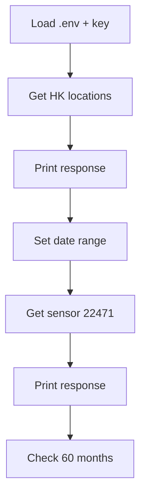

## README: OpenAQ API Query Script

## Overview
This README documents the API query workflow in [`my_good_query.py`](../01_query_api/my_good_query.py), which pulls air-quality data from the OpenAQ API. The script makes two calls: one to list monitoring locations in Hong Kong, and another to fetch monthly averages for a specific PM2.5 sensor. This supports the requirements in [`LAB_your_good_api_query.md`](../01_query_api/LAB_your_good_api_query.md) by returning more than 10 rows of data for analysis or reporting.

## API Endpoint and Parameters
**Base URL:** `https://api.openaq.org/v3`  
**Authentication:** API key in request header `x-api-key`

| Purpose | Endpoint | Parameters | Notes |
|---|---|---|---|
| List locations in Hong Kong | `/locations` | `iso=HK` | Returns monitoring locations and sensor IDs. |
| Monthly averages for sensor 22471 | `/sensors/22471/days/monthly` | `date_from`, `date_to` | Returns monthly averages for 2020-01-01 to 2025-12-31. |

**Header Used**
```
x-api-key: <YOUR_API_KEY>
```

**Query Parameters Used**
```
date_from=2020-01-01T00:00:00
date_to=2025-12-31T23:59:59
```

## Data Structure (High-Level)
OpenAQ responses are JSON objects with metadata and a list of results. The script prints the full JSON to the console. These are the key structures to look for when inspecting the output.

### 1) Locations Response (`/locations?iso=HK`)
| Field | Type | Description |
|---|---|---|
| `meta` | object | Metadata about the request (pagination, etc.). |
| `results` | array | List of monitoring locations. |
| `results[].id` | integer | Location ID. |
| `results[].name` | string | Location name. |
| `results[].coordinates` | object | Latitude/longitude for the location. |
| `results[].sensors` | array | Sensor objects or sensor IDs for the location. |

### 2) Monthly Averages Response (`/sensors/22471/days/monthly`)
| Field | Type | Description |
|---|---|---|
| `meta` | object | Metadata about the request. |
| `results` | array | One entry per month in the date range. |
| `results[].date` | object | Month or date identifier. |
| `results[].value` | number | Monthly average value for the sensor. |
| `results[].unit` | string | Measurement unit (e.g., µg/m³). |
| `results[].count` | integer | Number of observations in the month. |

**Note:** Field names may vary slightly depending on API updates. Use the printed JSON output to confirm exact keys in your environment.

## Query Flow (Mermaid)


## Usage Instructions
1. Ensure you have a `.env` file in the project root with your OpenAQ API key:
   - `X-API-Key=your_key_here`
2. Install dependencies (only once):
   - `pip install requests python-dotenv`
3. Run the script:
   - `python ../01_query_api/my_good_query.py`
4. Verify output:
   - Status codes should be `200`.
   - The monthly averages response should include about 60 records (2020–2025).

## Related Files
- Script: [`my_good_query.py`](../01_query_api/my_good_query.py)
- Lab instructions: [`LAB_your_good_api_query.md`](../01_query_api/LAB_your_good_api_query.md)
