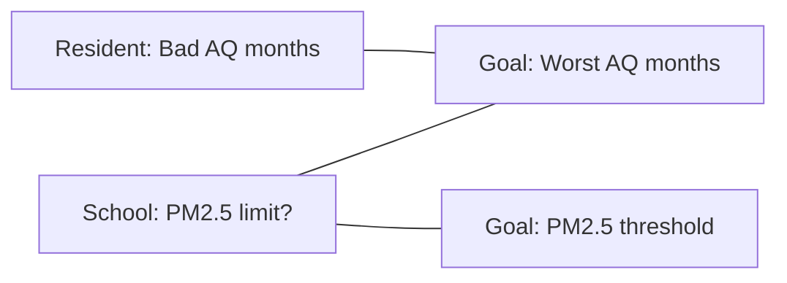

## Project Design for AI Product

### 🧱 Define Tool

- **Tool idea:** A **Stats Explainer** that uses the Tung Chung air-quality API query to explain PM2.5 health thresholds and highlight which months are typically worse.
- **Stakeholders and needs:**
  - Tung Chung resident (Hong Kong) — needs to know if air quality is stable across the year and which months are typically bad.
  - Tung Chung school zone — needs the PM2.5 threshold that limits outdoor activities and when that usually happens in a year.
- **System goals:**
  - Find the PM2.5 threshold value that may impact human health.
  - Summarize which months have worse air quality.

