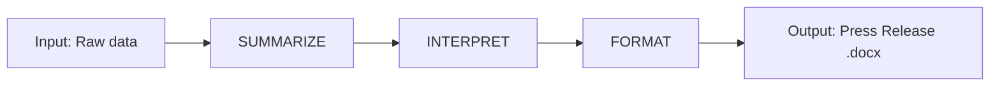

# Project Process Diagram for AI Product

This document outlines a high-level process for designing, building, and operating an AI product, from initial problem discovery through deployment and continuous improvement.

## 🔄 High-Level Workflow

## 🧩 Stage Descriptions

- **Air Quality - Data Reporter**: The AI product that turns raw air quality data into a press-ready narrative report.
- **Input: Raw data**: Ingest structured or semi-structured air quality measurements (e.g., PM2.5, ozone levels, timestamps, locations).
- **SUMMARIZE**: Condense the raw measurements into key trends, highlights, and anomalies over the relevant time window.
- **INTERPRET**: Translate the summarized patterns into human-meaningful insights (e.g., “air quality improved vs. last week,” “levels exceeded guidelines on X days”). 
- **FORMAT**: Organize the interpreted insights into a coherent press release structure (headline, key messages, supporting details) and export as a `.docx` document.

