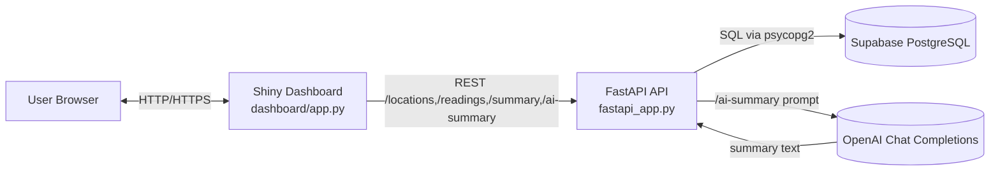

# City Congestion Tracker – Process Diagram

This diagram shows how the **Supabase PostgreSQL database**, **REST API (FastAPI)**, **dashboard app (Shiny for Python)**, and **AI model (OpenAI)** work together in a deployed setup on **DigitalOcean**.

## End-to-end flow (DigitalOcean deployment)

1. **User opens the dashboard**  
   - The browser connects to the **Shiny for Python dashboard** deployed on DigitalOcean.  
   - The dashboard is configured with `CONGESTION_API_URL=https://<your-fastapi-app>.ondigitalocean.app`.

2. **User sets filters and refreshes data**  
   - Date range and locations in the left sidebar.  
   - Clicks **Refresh Test A/B/C data**, which tells the dashboard which `dataset_label` (`dataset_a`, `dataset_b`, `dataset_c`) to request.

3. **Dashboard calls the REST API**  
   - The dashboard sends HTTP requests (via `httpx`) to the FastAPI service on DigitalOcean:
     - `GET /locations` – populate location checkboxes.
     - `GET /readings` – load raw readings for the selected dataset/time/location filters.
     - `GET /summary` – get per-location averages.

4. **REST API queries Supabase**  
   - FastAPI reads `SUPABASE_DB_*` from environment variables.  
   - Uses `psycopg2` to query the **Supabase PostgreSQL** database tables:
     - `locations`
     - `congestion_readings` (filtered by `dataset_label`, time window, and other params).

5. **Dashboard updates visuals**  
   - Using the API responses, the dashboard:
     - Updates the **average congestion** value box.
     - Draws the **daily average congestion** plot.
     - Fills the **Summary by location** and **Readings (preview)** tables.

6. **User requests AI summary**  
   - Clicking **Get AI summary** triggers `POST /ai-summary` on the FastAPI API.  
   - The API recomputes aggregated stats for the current filters and builds a compact text representation.

7. **REST API calls OpenAI**  
   - FastAPI reads `OPENAI_API_KEY` (and optional `OPENAI_MODEL`) from environment variables.  
   - Sends a prompt + table of stats to the **OpenAI Chat Completions** endpoint.  
   - Receives back a short, actionable congestion summary.

8. **AI summary is displayed in the dashboard**  
   - The API returns JSON with `summary` and supporting data.  
   - The dashboard displays the narrative in the **AI summary (OpenAI)** card.

Together, these components form a full pipeline:

> **Supabase (data) → FastAPI REST API → Shiny dashboard → OpenAI AI summaries**,  
> all wired together and exposed as two services on **DigitalOcean**.

