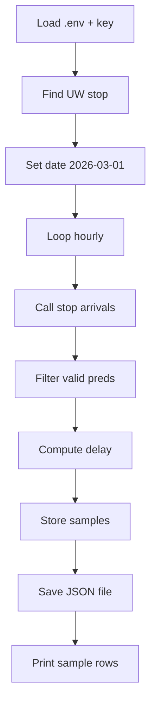

## README: OneBusAway Team Project Query

## Overview
This README documents the workflow in [`team_project_query_r0`](./team_project_query_r0), which queries the OneBusAway **"where"** REST API for a specific bus stop in Seattle and measures schedule vs. predicted arrival differences. The script focuses on **U District Station – Bay 3** (stop id `1_10911`) and collects delay samples over a fixed **24‑hour window on 2026‑03‑01**, saving the results to a JSON file for later analysis in the team project.

## API Endpoint and Parameters
**Base URL:** `https://api.pugetsound.onebusaway.org/api/where`  
**Authentication:** API key as query parameter `?key=YOUR_API_KEY`

| Purpose | Endpoint | Parameters | Notes |
|---|---|---|---|
| Find stop near UW | `/stops-for-location.json` | `lat`, `lon`, `radius`, `key` | Used once to confirm that “U District Station - Bay 3” (id `1_10911`) is near the UW campus. |
| Arrivals and departures for a stop | `/arrivals-and-departures-for-stop/1_10911.json` | `key`, `time`, `minutesBefore`, `minutesAfter` | Core query: returns scheduled and predicted arrivals for a 60‑minute window around a given time. |

**Key Parameters Used**
```text
time           = <epoch milliseconds for each hourly timestamp>
minutesBefore  = 0
minutesAfter   = 60
key            = ONEBUSAWAY_API_KEY (loaded from .env)
```

## Data Structure (High-Level)
OneBusAway responses are JSON objects wrapped in a top‑level `response` element that includes metadata and a `data` section. The script uses these parts of the `arrivals-and-departures-for-stop` response:

| Field | Type | Description |
|---|---|---|
| `data.entry.arrivalsAndDepartures` | array | List of arrival/departure records for the stop in the time window. |
| `arrivalsAndDepartures[].routeId` | string | Route identifier serving the stop. |
| `arrivalsAndDepartures[].tripId` | string | Trip identifier. |
| `arrivalsAndDepartures[].scheduledArrivalTime` | integer | Scheduled arrival time (ms since Unix epoch). |
| `arrivalsAndDepartures[].predictedArrivalTime` | integer or null | Real‑time predicted arrival (ms since Unix epoch), when available. |

In the script, each record with a valid `predictedArrivalTime` is converted into a simplified delay entry with:

| Field | Description |
|---|---|
| `routeId` | Copied from the API. |
| `tripId` | Copied from the API. |
| `scheduledArrival_ms` | Scheduled arrival time in milliseconds. |
| `predictedArrival_ms` | Predicted arrival time in milliseconds. |
| `delay_min` | Difference between predicted and scheduled times, in minutes. |
| `query_time` | The hourly timestamp used when calling the API. |

All such entries are collected into `all_samples` and written to `team_project_query_result.json`.

## Query Flow (Mermaid)


## Usage Instructions
1. Ensure you have a `.env` file in the project root with your OneBusAway API key, for example:  
   - `ONEBUSAWAY_API_KEY=your_key_here`
2. Install dependencies (only once):
   - `pip install requests python-dotenv`
3. From the project root, run the script:
   - `python Team_Project/team_project_query_r0`
4. Check console output:
   - Status codes printed for each hourly request should be `200`.
   - You should see a summary like:  
     `Collected N arrival samples between 2026-03-01 00:00:00 and 2026-03-02 00:00:00 (hourly queries).`
5. Inspect the saved results:
   - Open `Team_Project/team_project_query_result.json` to view the list of delay records for further analysis (e.g., in Python, R, or a notebook).

## Related Files
- Script: [`team_project_query_r0`](./team_project_query_r0)  
- Results: `team_project_query_result.json`
